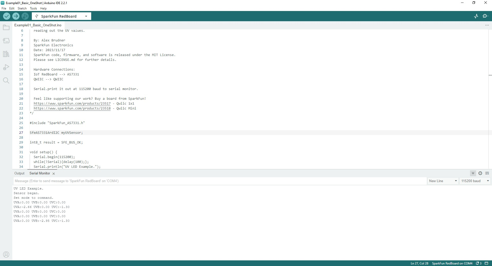

Now that we have the AS7331 Arduino library installed, let's take a closer look at a couple of the examples included in it.

## Example 1 - Basic One-Shot

The first example demonstrates the basics of configuring the AS7331, initializing it on the I<sup>2</sup>C bus to operate in command (one-shot) mode and printing out measured data over serial. This helps conserve power as the sensor powers on for a single measurement and conversion and then powers back down to sleep mode. Open the example in Arduino by navigating to <b>File</b> > <b>Examples</b> > <b>SparkFun AS7331 Arduino Library</b> > <b>Example01_Basic_OneShot</b> or you can copy the code below into a blank sketch. Select your <b>Board</b> and <b>Port</b> and click the <b>"Upload"</b> button.

??? "Example 1 - Basic One Shot"

    ```
     --8<-- "https://raw.githubusercontent.com/sparkfun/SparkFun_AS7331_Arduino_Library/main/examples/Example01_Basic_OneShot/Example01_Basic_OneShot.ino"
    ```

Once the code finishes uploading, open the [serial monitor](https://learn.sparkfun.com/tutorials/terminal-basics/arduino-serial-monitor-windows-mac-linux) with the baud set to <b>115200</b> and you should see the initialization success messages and then UV data begin to print out every 2 seconds like the screenshot below shows:

<div markdown>
<figure markdown>
[{ width="600" }](./assets/img/One_Shot_Example-Serial_Print.jpg "Click to enlarge")
<figcaption><i>Having trouble seeing the detail in the image? Click on it for a larger view.</i></figcaption>
</figure>
</div>

### Code to Note

The <code>myUVSensor.begin</code> function sets the AS7331 to operate in Command Mode (One Shot) by default. Switching to other modes requires calling the <code>myUVSensor.startMeasurement(MEAS_MODE_CONT)</code>. The other examples in the library demonstrate how to switch to the other three operating modes.

## Example 2 - Continuous Mode

Example 2 demonstrates how to change from the default settings to have the AS7331 operate in Continuous Mode. This example requires some additional assembly to connect the INT pin to an [interrupt-capable pin](https://www.arduino.cc/reference/en/language/functions/external-interrupts/attachinterrupt/) on your microcontroller. The example defaults to use D26 so adjust this line if you change which pin is used for the interrupt:

``` c++
const uint8_t interruptPin = 26;
``` 

Open the example in Arduino by navigating to <b>File</b> > <b>Examples</b> > <b>SparkFun AS7331 Arduino Library</b> > <b>Example01_Basic_OneShot</b> or you can copy the code below into a blank sketch. Select your <b>Board</b> and <b>Port</b> and click the <b>"Upload"</b> button.

??? "Example 2 - CONT Mode"

    ```
     --8<-- "https://raw.githubusercontent.com/sparkfun/SparkFun_AS7331_Arduino_Library/main/examples/Example02_CONT_Mode/Example02_CONT_Mode.ino"
    ```

After uploading, open the serial monitor with the baud set to <b>115200</b> and you should see the initialization messages print out followed by a continuous flow of UV data.

### Code to Note

As mentioned above, the <code>myUVSensor.begin</code> function sets the AS7331 to operate in Command Mode so after initializing the sensor the code sets the AS7331 to operate in Continuous Mode:

``` c++
// Set measurement mode and change device operating mode to measure.
  if(myUVSensor.startMeasurement(MEAS_MODE_CONT) == false) {
    Serial.println("Sensor did not get set properly.");
    Serial.println("Spinning...");
    while(1);
```

