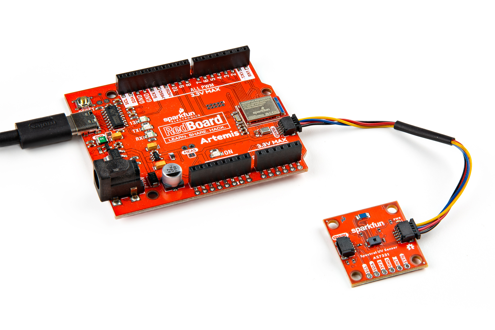

## Qwiic Assembly

Assembling these breakouts into a Qwiic circuit is as simple as plugging the board into your chosen microcontroller with a Qwiic cable. After assembling your circuit, it should look similar to the photos below:

<figure markdown>
[{ width="400" }](./assets/img/Spectral_UV_Sensor-Assembly4x6.jpg "Click to enlarge")
</figure>

<figure markdown>
[{ width="400" }](./assets/img/Spectral_UV_Sensor_Mini-Assembly4x6.jpg "Click to enlarge")
</figure>

## Soldered Assembly

Users who prefer a soldered connection or wish to use the SYNC and READY/INT pins should solder to the board for permanent connections.

??? note "New to soldering?"
	If you have never soldered before or need a quick refresher, check out our [How to Solder: Through-Hole Soldering](https://learn.sparkfun.com/tutorials/how-to-solder-through-hole-soldering) guide.
	

		<a href="https://learn.sparkfun.com/tutorials/5">
		 
        How to Solder: Through-Hole Soldering</a>
	

