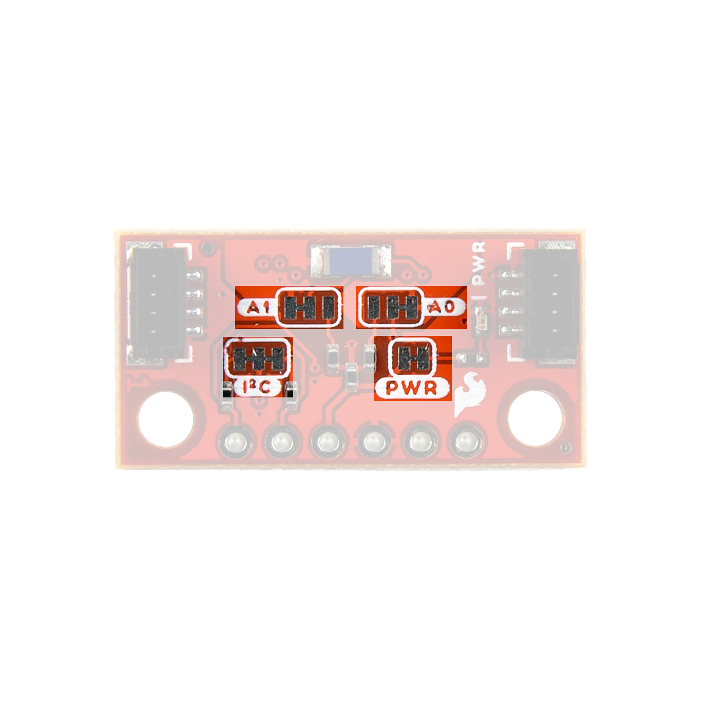
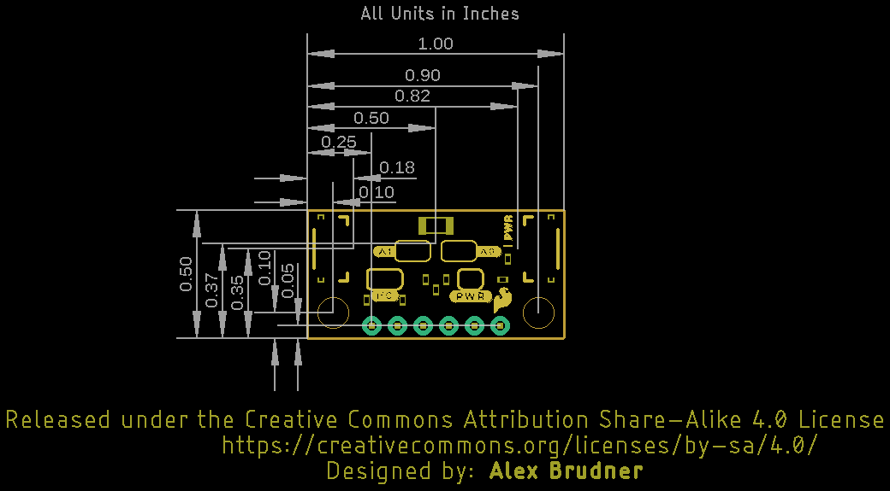

## AS7331 Spectral UV Sensor

The AS7331 spectral UV sensor from ams measures UV radiation over three channels (UVA, UVB, and UVC). Each channel is isolated from the other and has its own photodiode with a built-in filter to help with accuracy and interference from other channels.

<figure markdown>
[{ width="400" }](./assets/img/Spectral_UV_Sensor-AS7331.jpg "Click to enlarge")
</figure>

<figure markdown>
[{ width="400" }](./assets/img/Spectral_UV_Sensor_Mini-AS7331.jpg "Click to enlarge")
</figure>

The AS7331 has extensive configuration options to customize the sensor's responsiveness, sensitivity, clock speed, and conversion time, among other settings. These configuration options allow users to optimize the sensor for their application. For example, a high gain setting results in a more sensitive response from the sensor but a lower maximum detectable irradiance (in &micro;W/cm2) whereas a low gain has much less sensitivity but a much higher maximum detectable irradiance. For detailed information on the conversion equations and how all the available settings affect performance, refer to section 7.4 of the [datasheet](./assets/component_documentation/AS7331_DS001047_4-00.pdf) Note, these configurations apply across all three channels. It has four operating modes: Command (CMD), Continuous (CONT), Synchronized Start (SYNS), and Synchronized Start/End (SYND). The list below outlines the operating modes' behaviors: 

* CMD Mode - "One-shot" mode. Takes a single measurement and conversion controlled by the I2C interface.
* CONT Mode - Continous mode. Takes continuous measurements and conversions on set intervals. 
* SYNS Mode - Synchronized start mode. A connected microcontroller starts measurements through an I/O pin connected to the SYN pin.
* SYND Mode - Synchronized start and stop mode. A connected microcontroller starts and stops measurements through an I/O pin connected to the SYN pin.

 The sensor operates over I2C with a pin-configured I2C address supporting four separate addresses (the breakout board sets this to 0x74 by default). Refer to the [datasheet](./assets/component_documentation/AS7331_DS001047_4-00.pdf) for a complete overview of the AS7331.

## Qwiic and PTH Pins

Both boards include a pair of Qwiic connectors for the I2C interface (SDA, SCL, 3.3V, and Ground) as well as a 0.1"-spaced plated through hole (PTH) header that includes power supply pins (3.3V and Ground) the I2C interface as well as the AS7331's SYNC and READY/INT pins.

<figure markdown>
[{ width="400" }](./assets/img/Spectral_UV_Sensor-AS7331.jpg "Click to enlarge")
</figure>

<figure markdown>
[{ width="400" }](./assets/img/Spectral_UV_Sensor_Mini-Qwiic.jpg "Click to enlarge")
</figure>

### Power

The AS7331 accepts a supply voltage between <b>2.7V</b> and <b>3.6V</b>. Power to these boards can be supplied either over one of the Qwiic connectors or through the <b>3.3V</b> and <b>GND</b> PTH pins.

## LEDs

These breakouts only have a red Power LED to indicate whenever the board is powered.

<figure markdown>
[{ width="400" }](./assets/img/Spectral_UV_Sensor-LED.jpg "Click to enlarge")
</figure>

<figure markdown>
[{ width="400" }](./assets/img/Spectral_UV_Sensor_Mini-LED.jpg "Click to enlarge")
</figure>

## Jumpers

??? note "Never modified a jumper before?"
	Check out our <a href="https://learn.sparkfun.com/tutorials/664">Jumper Pads and PCB Traces tutorial</a> for a quick introduction!
	

		<a href="https://learn.sparkfun.com/tutorials/664">
		 
        How to Work with Jumper Pads and PCB Traces</a>
	

The boards have three solder jumpers labeled <b>PWR</b>, <b>A0</b>, and <b>A1</b>. The PWR jumper completes the power LED circuit. Open it to disable the Power LED to help reduce the current consumption. The A0 and A1 solder jumpers control the AS7331's I2C address. They default to tie both address pins to Ground to set the I2C address to <b>0x74</b>. The table below outlines the jumper positions for the four available I2C addresses:

<figure markdown>
[{ width="400" }](./assets/img/Spectral_UV_Sensor-Jumpers.jpg "Click to enlarge")
</figure>

<figure markdown>
[{ width="400" }](./assets/img/Spectral_UV_Sensor_Mini-Jumpers.jpg "Click to enlarge")
</figure>

<table>
	<tr>
		<th>A1</th>
		<th>A0</th>
		<th>Address</th>
	</tr>
	<tr>
		<td>GND</td>
		<td>GND</td>
		<td>0x74 (default)</td>
	</tr>
	<tr>
		<td>GND</td>
		<td>VDD</td>
		<td>0x75</td>
	</tr>
	<tr>
		<td>VDD</td>
		<td>GND</td>
		<td>0x76</td>
	</tr>
	<tr>
		<td>VDD</td>
		<td>VDD</td>
		<td>0x77</td>
	</tr>
</table>

## Board Dimensions

The Standard version of the Spectral UV Sensor measures 1.00" x 1.00" (25.4mm x 25.4mm) and the Mini version measures 1.00" x 0.50" (25.4mm x 12.7mm). The Standard has four mounting holes and the Mini has two mounting holes. All of these fit a [4-40 screw]().

<figure markdown>
[{ width="400" }](./assets/board_files/SparkFun_Qwiic_UV_Sensor_AS7331-Dimensions.png "Click to enlarge")
</figure>

<figure markdown>
[{ width="400" }](./assets/board_files/SparkFun_Qwiic_Mini_UV_Sensor_AS7331-Dimensions.png "Click to enlarge")
</figure>

??? tip "Need more measurements?"
	For more information about the board's dimensions, users can download the Eagle files([Standard](./assets/board_files/SparkFun_Qwiic_UV_Sensor_AS7331.zip) & [Mini](./assets/board_files/SparkFun_Qwiic_Mini_UV_Sensor_AS7331.zip)) for the board. These files can be opened in Eagle and additional measurements can be made with the dimensions tool.

	??? info ":octicons-download-16:{ .heart } Eagle - Free Download!"
		Eagle is a [CAD]("computer-aided design") program for electronics that is free to use for hobbyists and students. However, it does require an account registration to utilize the software.

		

		[Download from :autodesk-primary:{ .autodesk }](https://www.autodesk.com/products/eagle/free-download "Go to downloads page"){ .md-button .md-button--primary width="250px" }
		

	
	??? info ":straight_ruler: Dimensions Tool"
		This video from Autodesk demonstrates how to utilize the dimensions tool in Eagle, to include additional measurements:

		

		

		<iframe src="https://www.youtube.com/embed/dZLNd1FtNB8" title="EAGLE Dimension Tool" frameborder="0" allow="accelerometer; autoplay; clipboard-write; encrypted-media; gyroscope; picture-in-picture" allowfullscreen></iframe>
		

		
